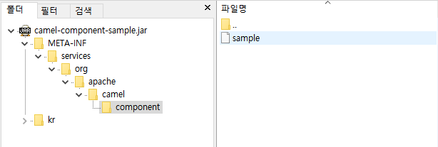

APACHE CAMEL CUSTOM COMPONENT
=============================

How to writing camel custom components and download sample camel custom componet

<!--more-->

* Contents
	
	1. Writing Component
	2. Deploying Component
	3. Configure Endpoint (Writing DSL)
	4. Run DSL and Log
	

* Download Sample project

	[sample-project.zip](https://github.com/torpedocorp/torpedocorp.github.io/blob/master/_posts/2018-09-10-writing-custom-component.zip)

----------

# Writing Component #
1. SampleComponent.java

	
		package kr.co.torpedo.camel.sample.component;
		
		import java.util.Map;
		
		import org.apache.camel.Endpoint;
		import org.apache.camel.impl.DefaultComponent;
		import org.slf4j.Logger;
		import org.slf4j.LoggerFactory;
		
		public class SampleComponent extends DefaultComponent {
		
			private static Logger logger = LoggerFactory.getLogger(SampleComponent.class);
			
			 
		    protected Endpoint createEndpoint(String uri, String remaining, Map<String, Object> parameters) throws Exception {
		    	SampleEndpoint endpoint = new SampleEndpoint(uri, this);
		        setProperties(endpoint, parameters);
		        logger.debug("***** SampleComponent create endpoint ");
		        return endpoint;
		    }
		
		}

	

2. SampleConsumerPoll.java

		package kr.co.torpedo.camel.sample.component;
		import org.apache.camel.Exchange;
		import org.apache.camel.Processor;
		import org.apache.camel.impl.ScheduledPollConsumer;
		import org.slf4j.Logger;
		import org.slf4j.LoggerFactory;
		public class SampleConsumerPoll extends ScheduledPollConsumer {
		    private final SampleEndpoint endpoint;
		
		    private static Logger logger = LoggerFactory.getLogger(SampleConsumerPoll.class);
		
		    
		    public SampleConsumerPoll(SampleEndpoint endpoint, Processor processor) {
		        super(endpoint, processor);
		        this.endpoint = endpoint;
		        this.setDelay(10000);
		    }
		
		    @Override
		    protected int poll() throws Exception {
		        Exchange exchange = endpoint.createExchange();
		        try {
		        	logger.debug("***** SampleConsumerPoll sample consummer polling");
		            getProcessor().process(exchange);
		            return 1; // number of messages polled
		        } finally {
		            // log exception if an exception occurred and was not handled
		            if (exchange.getException() != null) {
		                getExceptionHandler().handleException("Error processing exchange", exchange, exchange.getException());
		            }
		        }
		        
		    }
		    
		}

3. SampleEndpoint.java

		package kr.co.torpedo.camel.sample.component;
		import org.apache.camel.Consumer;
		import org.apache.camel.Processor;
		import org.apache.camel.Producer;
		import org.apache.camel.impl.DefaultEndpoint;
		import org.apache.camel.spi.UriEndpoint;
		import org.apache.camel.spi.UriParam;
		import org.slf4j.Logger;
		import org.slf4j.LoggerFactory;
		
		@UriEndpoint(firstVersion = "1.4.0", scheme = "sample", title = "sample", syntax = "sample", consumerClass = SampleConsumerDefault.class, label = "sample")
		public class SampleEndpoint extends DefaultEndpoint {
			
			public static Logger logger = LoggerFactory.getLogger(SampleEndpoint.class);
		
		
			@UriParam(label = "testopt1", description = "testopt1")
			private String testopt1;
			
			@UriParam(label = "testopt2", description = "testopt2")
			private String testopt2;
			
			public String toString(){
				StringBuffer sb = new StringBuffer();
				sb.append("testopt2="+this.testopt2);
				sb.append(" testopt2="+this.testopt2);
				return sb.toString();
			}
		
			public SampleEndpoint(String uri, SampleComponent component) {
				super(uri, component);
			}
		
			public SampleEndpoint(String endpointUri) {
				super(endpointUri);
			}
		
			public Producer createProducer() throws Exception {
				return new SampleProducer(this);
			}
		
			public Consumer createConsumer(Processor processor) throws Exception {
				return new SampleConsumerPoll(this, processor);
			}
		
			public boolean isSingleton() {
				return true;
			}
		
		}

4. SampleProducer.java

		package kr.co.torpedo.camel.sample.component;
		import java.io.File;
		import java.io.IOException;
		import java.util.ArrayList;
		
		import org.apache.camel.Exchange;
		import org.apache.camel.impl.DefaultProducer;
		import org.slf4j.Logger;
		import org.slf4j.LoggerFactory;
		
		public class SampleProducer extends DefaultProducer {
		    
			public static Logger logger = LoggerFactory.getLogger(DefaultProducer.class);
		
			 
			 ArrayList<String> columnList = new ArrayList<String>();
			 
			String runSql = "";
			
		    private SampleEndpoint endpoint;
		
		    public SampleProducer(SampleEndpoint endpoint) throws IOException {
		        super(endpoint);
		        this.endpoint = endpoint;
		       
		    }
		
		    public void process(Exchange exchange) throws Exception {
		    	String filepath = (String) exchange.getIn().getHeaders().get("CamelFileAbsolutePath");
		    	File file = new File(filepath);
		    }
		    
		    public static void main(String args[]) throws Exception{
		    	String filepath =  "misc/doc/ESB_DATA/test/I015708159999410_IL09001000_B60060010_004504";
		    	File file = new File(filepath);
		    }
		
		}

----------

# Deploying Component #

	서비스 파일 작성 

		파일 위치 META-INF/services/org/apache/camel/component/sample
		파일 내용 class=kr.co.torpedo.camel.sample.component.SampleComponent

	

----------

# Configure Endpoint #
		
	camel-route.xml

		<?xml version="1.0" encoding="UTF-8"?>
		<beans xmlns="http://www.springframework.org/schema/beans"
			xmlns:xsi="http://www.w3.org/2001/XMLSchema-instance"
			xsi:schemaLocation="
		        http://www.springframework.org/schema/beans http://www.springframework.org/schema/beans/spring-beans-2.5.xsd
		        http://camel.apache.org/schema/spring http://camel.apache.org/schema/spring/camel-spring.xsd">
		
		
			<camelContext id="camel" xmlns="http://camel.apache.org/schema/spring">
				<route>
					<from uri="sample:testopt1=testopt1&amp;testopt2=testopt2" />
					<to uri="sample:testopt1=testopt1&amp;testopt2=testopt2" />
				</route>
			</camelContext>
		
		</beans>

----------

# Run DSL and Log #
	
**Run DSL**
	
		package kr.co.torpedo.camel.sample.component;

		import org.apache.camel.spring.Main;
		import org.slf4j.Logger;
		import org.slf4j.LoggerFactory;
		
		public class CamelApplicationTest {
			
			private static Logger logger = LoggerFactory.getLogger(CamelApplicationTest.class);
					
			public static void main(String args[]) {
				String routeXml = "camel-route.xml";
				Main main = new Main();
				main.setApplicationContextUri(routeXml);
				try {
					main.start();
					Thread.sleep(10000);
				} catch (Exception e) {
					// TODO Auto-generated catch block
					e.printStackTrace();
				}
			}		
		}

**Run DSL log**

	9월 10, 2018 1:39:19 오후 org.springframework.context.support.ClassPathXmlApplicationContext prepareRefresh
	정보: Refreshing org.springframework.context.support.ClassPathXmlApplicationContext@2f333739: startup date [Mon Sep 10 13:39:19 KST 2018]; root of context hierarchy
	9월 10, 2018 1:39:19 오후 org.springframework.beans.factory.xml.XmlBeanDefinitionReader loadBeanDefinitions
	정보: Loading XML bean definitions from class path resource [camel-route.xml]
	13:39:20.308 [main] DEBUG org.apache.camel.spring.handler.CamelNamespaceHandler - Using org.apache.camel.spring.CamelContextFactoryBean as CamelContextBeanDefinitionParser
	13:39:21.141 [main] DEBUG org.apache.camel.spring.handler.CamelNamespaceHandler - Registered default: org.apache.camel.spring.CamelProducerTemplateFactoryBean with id: template on camel context: camel
	13:39:21.142 [main] DEBUG org.apache.camel.spring.handler.CamelNamespaceHandler - Registered default: org.apache.camel.spring.CamelFluentProducerTemplateFactoryBean with id: fluentTemplate on camel context: camel
	13:39:21.143 [main] DEBUG org.apache.camel.spring.handler.CamelNamespaceHandler - Registered default: org.apache.camel.spring.CamelConsumerTemplateFactoryBean with id: consumerTemplate on camel context: camel
	13:39:21.421 [Camel Thread #0 - LRUCacheFactory] DEBUG org.apache.camel.util.LRUCacheFactory - Warming up LRUCache ...
	13:39:21.439 [main] DEBUG org.apache.camel.spring.SpringCamelContext - Set the application context classloader to: sun.misc.Launcher
	~~~~~~~~~~~~~~~~~~~~~~~~ 중간 생략 ~~~~~~~~~~~~~~~~~~~~~~~~~~~~~~~~~~~~~~~~~~~~~~~~~~~~~~~~~~~~~~~~~~~~~~~~~~~~~~~~~~~~~
	
	13:39:21.866 [main] DEBUG org.apache.camel.util.ResolverHelper - Lookup Component with name sample-component in registry. Found: null
	13:39:21.868 [main] DEBUG org.apache.camel.impl.DefaultComponentResolver - Found component: sample via type: kr.co.torpedo.camel.sample.component.SampleComponent via: META-INF/services/org/apache/camel/component/sample
	13:39:21.870 [main] DEBUG org.apache.camel.management.DefaultManagementAgent - Registered MBean with ObjectName: org.apache.camel:context=camel,type=components,name="sample"
	13:39:21.870 [main] DEBUG org.apache.camel.impl.DefaultComponent - Cannot resolve property placeholders on component: kr.co.torpedo.camel.sample.component.SampleComponent@767e20cf as PropertiesComponent is not in use
	13:39:21.872 [main] DEBUG org.apache.camel.impl.DefaultComponent - Creating endpoint uri=[sample://testopt1=testopt1&testopt2=testopt2], path=[testopt1=testopt1&testopt2=testopt2]
	13:39:21.875 [main] DEBUG kr.co.torpedo.camel.sample.component.SampleComponent - ***** SampleComponent create endpoint 
	13:39:21.876 [main] DEBUG org.apache.camel.spring.SpringCamelContext - sample://testopt1=testopt1&testopt2=testopt2 converted to endpoint: testopt2=null testopt2=null by component: kr.co.torpedo.camel.sample.component.SampleComponent@767e20cf
	13:39:21.882 [main] DEBUG org.apache.camel.management.DefaultManagementAgent - Registered MBean with ObjectName: org.apache.camel:context=camel,type=endpoints,name="sample://testopt1=testopt1&testopt2=testopt2"
	
	~~~~~~~~~~~~~~~~~~~~~~~~ 중간 생략 ~~~~~~~~~~~~~~~~~~~~~~~~~~~~~~~~~~~~~~~~~~~~~~~~~~~~~~~~~~~~~~~~~~~~~~~~~~~~~~~~~~~~~
	13:39:21.889 [main] DEBUG org.apache.camel.processor.interceptor.DefaultChannel - Initialize channel for target: 'To[sample:testopt1=testopt1&testopt2=testopt2]'
			13:39:21.997 [main] DEBUG org.apache.camel.main.MainSupport - Starting Spring ApplicationContext: org.springframework.context.support.ClassPathXmlApplicationContext@2f333739
	9월 10, 2018 1:39:21 오후 org.springframework.context.support.DefaultLifecycleProcessor start
	정보: Starting beans in phase 2147483646
	13:39:22.002 [main] DEBUG org.apache.camel.spring.SpringCamelContext - onApplicationEvent: org.springframework.context.event.ContextStartedEvent[source=org.springframework.context.support.ClassPathXmlApplicationContext@2f333739: startup date [Mon Sep 10 13:39:19 KST 2018]; root of context hierarchy]
	13:39:22.993 [Camel (camel) thread #1 - sample://testopt1=testopt1&testopt2=testopt2] DEBUG kr.co.torpedo.camel.sample.component.SampleConsumerPoll - ***** SampleConsumerPoll sample consummer polling
	13:39:23.000 [Camel (camel) thread #1 - sample://testopt1=testopt1&testopt2=testopt2] DEBUG org.apache.camel.processor.SendProcessor - >>>> testopt2=null testopt2=null Exchange[ID-sushin-1536554361317-0-1]
	13:39:23.001 [Camel (camel) thread #1 - sample://testopt1=testopt1&testopt2=testopt2] DEBUG org.apache.camel.impl.DefaultProducer - ***** SampleProducer processing 
