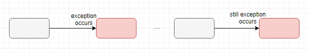

### Apache Camel - Error Handling (1)

#### 1. Error 종류
1. Recoverable error


* 일시적인 오류
* 전송 실패가 한번 나왔다하더라도 좀 더 시간이 흐른 뒤 다시 시도했을 때는 성공할 error를 뜻한다.

2. Irrecoverable error



* Rocoverable error와 다르게, 전송 실패가 나온 뒤 다시 전송 시도해도 실패가 나오는 error


#### 2. Error가 발생하는 시점
Camel에서 error가 발생할 수 있는 곳은 **routing** 할 때/message를 **processing** 하는 과정에서 error가 발생할 수 있다.


#### 3. Error Handling 범위
1. Global
* \<camelContext>에 작성하여 사용한다.
* Global 범위로 적용하게 되면 \<camelContext> 안에 존재하는 모든 \<route>에서 정의한 error handler를 사용할 수 있다.

```
<camelContext xmlns="http://camel.apache.org/schema/spring" errorHandlerRef="bizframeErr">
  <errorHandler id="bizframeErr" type="DefaultErrorHandler">
    <redeliveryPolicy maximumRedeliveries="3" retryAttemptedLogLevel="WARN" />
  </errorHandler>

  <route>
    <from uri="file:d:/camel/src?delay=2000" />
    <to uri="file://d:/camel/output" />
  </route>
</camelContext>
```

* camelContext에 ```errorHandlerRef="bizframeErr"```라고 정의하였다. 이건 사용자가 error handler를 사용하기 위해서 정의한 bizframeErr를 camelContext 안에 존재하는 모든 routes에서 사용할 수 있도록 설정하겠다! 하는 것이다.

2. Route
* \<route> 구문에 적용하여 사용한다.
* Global 범위와 달리, 모든 route에서 사용할 수 없고 지정한 하나의 route에서만 사용할 수 있다.

```
<camelContext xmlns="http://camel.apache.org/schema/spring" errorHandlerRef="bizframeErr">
  <errorHandler id="bizframeErr" type="DefaultErrorHandler">
  </errorHandler>

  <route id="first" errorHandlerRef="bizframeErr">
    <from uri="file:d:/camel/src?delay=2000" />
    <to uri="file://d:/camel/output" />
  </route>

  <route id="second">
    <from uri="file:d:/camel/input/src?delay=2000"/>
    <to uri="http://localhost:10040/myService/" />
  </route>
</camelContext>
```

* ```id="first"```라는 route에만 error handler를 설정하였다. 이 말은,  ```id="first"```인 route에는 ```"bizframeErr"``` error handler를 사용할 수 있지만, ```id="second"```인 route에서는 ```bizframeErr``` error handler를 사용할 수 없다는 것과 같다. 만약 error handler를 사용하고 싶다면 global 단위로 설정하거나, 따로 ```"second"``` route에 error handler를 설정해주어야 한다.
